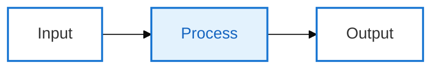
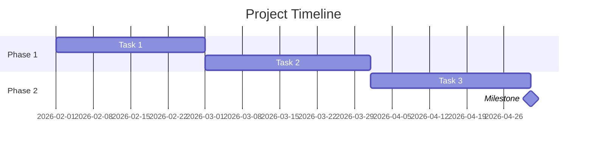
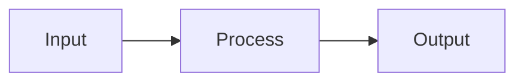

# Mermaid 다이어그램 생성기

사용자 요구사항을 기반으로 고품질 Mermaid 다이어그램 코드를 생성합니다.

## 워크플로우

1. **요구사항 이해**: 사용자 설명을 분석하여 가장 적합한 다이어그램 유형 결정
2. **문서 읽기**: 다이어그램 유형에 해당하는 문법 레퍼런스 읽기
3. **코드 생성**: 명세에 따라 Mermaid 코드 생성
4. **스타일 적용**: 적절한 테마 및 스타일 설정 적용

## 다이어그램 유형 레퍼런스

적절한 다이어그램 유형을 선택하고 해당 문서를 읽으세요:

| 유형 | 문서 | 사용 사례 |
| ---- | ---- | --------- |
| Flowchart | [flowchart.md](references/flowchart.md) | 프로세스, 결정, 단계 |
| Sequence Diagram | [sequenceDiagram.md](references/sequenceDiagram.md) | 상호작용, 메시징, API 호출 |
| Class Diagram | [classDiagram.md](references/classDiagram.md) | 클래스 구조, 상속, 연관 |
| State Diagram | [stateDiagram.md](references/stateDiagram.md) | 상태 머신, 상태 전이 |
| ER Diagram | [entityRelationshipDiagram.md](references/entityRelationshipDiagram.md) | 데이터베이스 설계, 엔티티 관계 |
| Gantt Chart | [gantt.md](references/gantt.md) | 프로젝트 계획, 타임라인 |
| Pie Chart | [pie.md](references/pie.md) | 비율, 분포 |
| Mindmap | [mindmap.md](references/mindmap.md) | 계층적 구조, 지식 그래프 |
| Timeline | [timeline.md](references/timeline.md) | 역사적 이벤트, 마일스톤 |
| Git Graph | [gitgraph.md](references/gitgraph.md) | 브랜치, 병합, 버전 |
| Quadrant Chart | [quadrantChart.md](references/quadrantChart.md) | 4분면 분석 |
| Requirement Diagram | [requirementDiagram.md](references/requirementDiagram.md) | 요구사항 추적성 |
| C4 Diagram | [c4.md](references/c4.md) | 시스템 아키텍처 (C4 모델) |
| Sankey Diagram | [sankey.md](references/sankey.md) | 흐름, 전환 |
| XY Chart | [xyChart.md](references/xyChart.md) | 선형 차트, 막대 차트 |
| Block Diagram | [block.md](references/block.md) | 시스템 컴포넌트, 모듈 |
| Packet Diagram | [packet.md](references/packet.md) | 네트워크 프로토콜, 데이터 구조 |
| Kanban | [kanban.md](references/kanban.md) | 작업 관리, 워크플로우 |
| Architecture Diagram | [architecture.md](references/architecture.md) | 시스템 아키텍처 |
| Radar Chart | [radar.md](references/radar.md) | 다차원 비교 |
| Treemap | [treemap.md](references/treemap.md) | 계층적 데이터 시각화 |
| User Journey | [userJourney.md](references/userJourney.md) | 사용자 경험 흐름 |
| ZenUML | [zenuml.md](references/zenuml.md) | 시퀀스 다이어그램 (코드 스타일) |

## 설정 & 테마

- [테마](references/config-theming.md) - 커스텀 색상 및 스타일
- [지시문](references/config-directives.md) - 다이어그램 수준 설정
- [레이아웃](references/config-layouts.md) - 레이아웃 방향 및 간격
- [설정](references/config-configuration.md) - 전역 설정
- [수식](references/config-math.md) - LaTeX 수학 지원

## 출력 명세

생성된 Mermaid 코드는:

1. ```mermaid 코드 블록으로 감싸야 함
2. 직접 렌더링 가능한 올바른 문법 사용
3. 적절한 줄바꿈과 들여쓰기로 명확한 구조
4. 의미 있는 노드 이름 사용
5. **색상 스타일링 없음** - 색상 없이 깔끔하고 단순하게 유지
6. 명확성에 집중한 최소한의 전문적인 스타일

## 기본 스타일 가이드라인

**중요**: 모든 다이어그램에 이 스타일 규칙을 따르세요:

- 커스텀 색상 없음 - 기본 스타일링만 사용
- 흰색/투명 배경 - 깔끔하고 전문적
- 최소한의 노드 - 필수 정보만
- 명확한 레이블 - 중복 없는 간결한 텍스트
- 단순한 구조 - 복잡한 그래프보다 선형 흐름 선호

**Gantt 차트 스타일** (타임라인 및 일정에 권장):
- 프로젝트 타임라인, 일정, 로드맵에는 `gantt` 유형 사용
- 섹션 기반의 깔끔한 구성
- 주요 성과에 마일스톤
- 커스텀 색상 불필요

**mmdc로 PNG 생성 시**:
```bash
# 설정이 있는 전문적인 테마 사용
mmdc -i diagram.mmd -o diagram.png -w 1200 -H 600 -b white -c config.json
```

**전문적인 테마 설정** (config.json으로 생성):

**옵션 1: 깔끔한 비즈니스 스타일 (권장)**
```json
{
  "theme": "base",
  "themeVariables": {
    "primaryColor": "#ffffff",
    "primaryTextColor": "#333333",
    "primaryBorderColor": "#1976d2",
    "lineColor": "#888888",
    "secondaryColor": "#f5f5f5",
    "tertiaryColor": "#e3f2fd",
    "tertiaryBorderColor": "#1976d2",
    "tertiaryTextColor": "#1565c0",
    "fontFamily": "Inter, Segoe UI, Roboto, sans-serif",
    "fontSize": "12px"
  },
  "flowchart": {
    "curve": "cardinal",
    "nodeSpacing": 50,
    "rankSpacing": 50,
    "padding": 20
  },
  "gantt": {
    "titleTopMargin": 25,
    "barGap": 4,
    "topPadding": 50,
    "sidePadding": 75,
    "gridLineStartPadding": 10,
    "fontSize": 12,
    "sectionFontSize": 14
  }
}
```

**옵션 2: 중립 인쇄 스타일 (PDF/인쇄용)**
```json
{
  "theme": "neutral",
  "themeVariables": {
    "fontFamily": "Inter, sans-serif",
    "fontSize": "12px"
  },
  "flowchart": {
    "curve": "basis",
    "nodeSpacing": 50,
    "padding": 20
  }
}
```

**classDef를 사용한 고급 스타일링:**


이로써 다음을 갖춘 현대적이고 세련된 다이어그램이 만들어집니다:
- 전문적인 Neo 영감 룩
- 최적의 간격 및 패딩
- 미묘한 파란색 포인트 (#1976d2)
- 현대적인 타이포그래피 (Inter 폰트)
- 깔끔한 gantt 차트 스타일링

**피해야 할 것**:
- 다중 색상 (style fill:#color)
- 복잡한 중첩 서브그래프
- 과도한 노드 스타일링
- 장식적 요소

## 출력 예시

**단순 플로우차트** (색상 없음):


**Gantt 차트** (타임라인에 권장):


**단순 프로세스 흐름**:


---

사용자 요구사항: $ARGUMENTS
